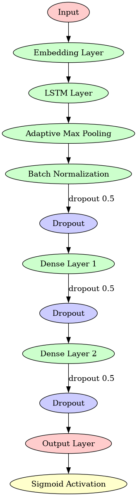

# Классификация сообщений (спам/не спам) 📧

## Описание проекта 📎
Этот проект посвящен разработке моделей для классификации текстовых сообщений на спам и не-спам. Основная целевая метрика проекта — ROC-AUC. Мы стремимся обеспечить высокую точность определения спама, используя различные подходы машинного обучения и анализа данных.

## Структура ноутбука
1. **Импорт библиотек**
2. **Предварительный анализ данных (EDA)**
   - Проверка баланса классов
   - Сравнение распределений длин слов для спама и не спама
   - Облако слов для визуализации часто используемых слов
   - Кластеризация текстов для выявления скрытых структур
3. **Предобработка текстов**
   - Очистка текста от стоп-слов
   - Удаление неинформативных слов
   - Приведение всех слов к нижнему регистру
   - [Лемматизация](https://ru.wikipedia.org/wiki/Лемматизация)
   - Преобразование текстов в векторы с использованием GloVe эмбеддингов для LSTM
   - Создание представлений TF-IDF для Bag of Words
4. **Модели**
   - Логистическая регрессия на TF-IDF признаках
   - K-Means на TF-IDF признаках + Логистическая регрессия на расстояниях до центров кластеров
   - Латентное размещение Дирихле (LDA) + Логистическая регрессия на вероятностях тем
   - NaiveBayes на TF-IDF признаках
   - NaiveBayes на CountVectorizer
   - Бустинг на TF-IDF признаках
   - LSTM на GloVe эмбеддингах слов
5. **Сравнение лучших кандидатов**
   - Сравнение качества на общей отложенной выборке
   - Калибровочные кривые
   - ROC и PR-кривые
   - Распределение вероятностей
6. **Предсказания LSTM на тесте**

## Модели и результаты 🧪
Результаты подбора параметров представлены в табличке. Результаты указаны для моделей на лучших гиперпараметров.
| Модель        | ROC-AUC | Метод подбора параметров     |
|---------------|---------|------------------------------|
| Логистическая регрессия на TF-IDF | 0.9777  | Кросс-валидация             |
| K-Means + Логистическая регрессия | 0.972   | Кросс-валидация             |
| LDA + Логистическая регрессия     | 0.876   | Кросс-валидация             |
| NaiveBayes на TF-IDF              | 0.9713  | Кросс-валидация             |
| NaiveBayes на CountVectorizer     | 0.9704  | Кросс-валидация             |
| Бустинг на TF-IDF                 | 0.9762  | Optuna                      |
| LSTM на GloVe эмбеддингах         | 0.9816  | Оптимизатор RMSProp         |

Наиболее качественные результата показала наиболее сложная архитектура - LSTM на основе GloVe эмбеддингов (эмбеддинги дообучались), обученная для классификации. Схема модели: